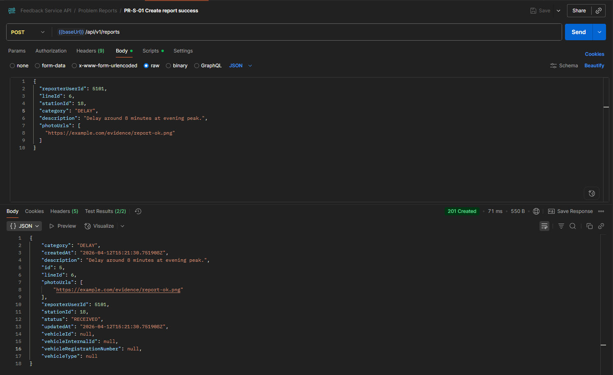
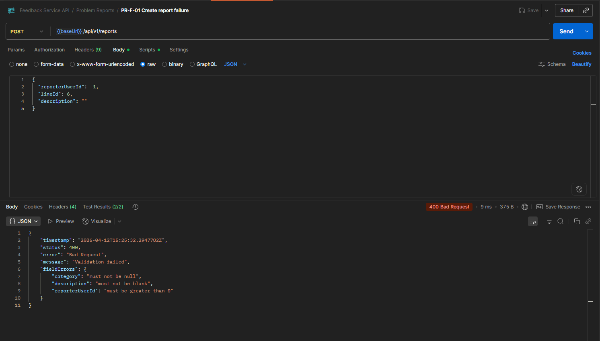
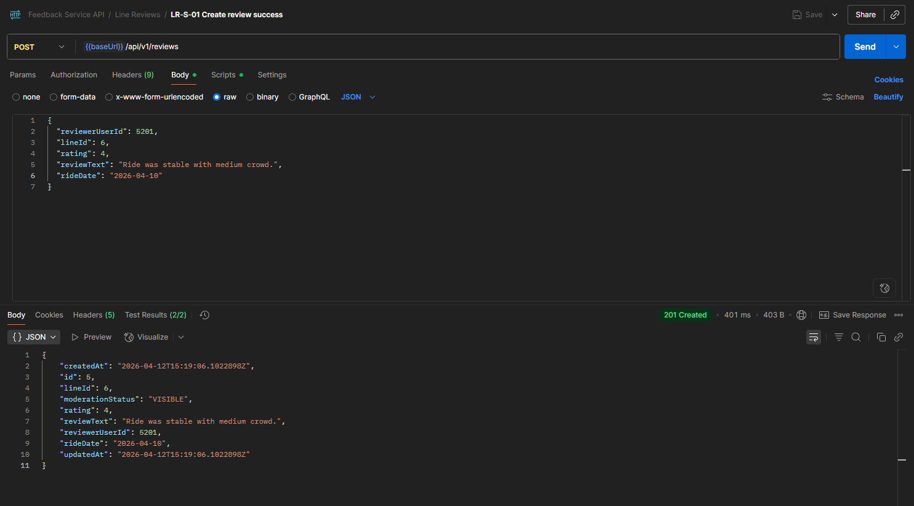
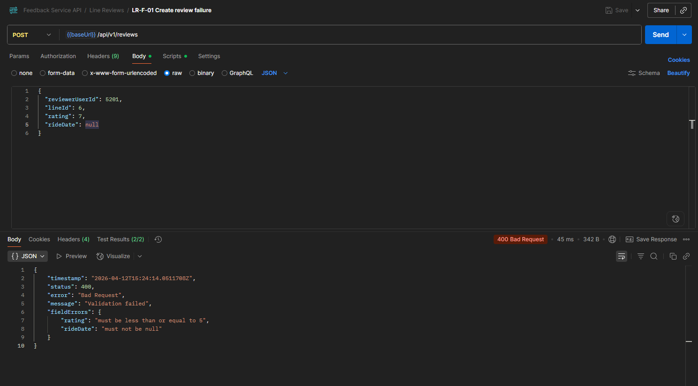

# Screenshots from tests

Successful create problem report request-response (HTTP 201).

Failed create problem report request-response with invalid payload (HTTP 400).

Successful create line review request-response (HTTP 201).

Failed create line review request-response with invalid payload (HTTP 400).

Recommended source requests are already in the collection:

- docs/postman/feedbackservice.postman_collection.json
