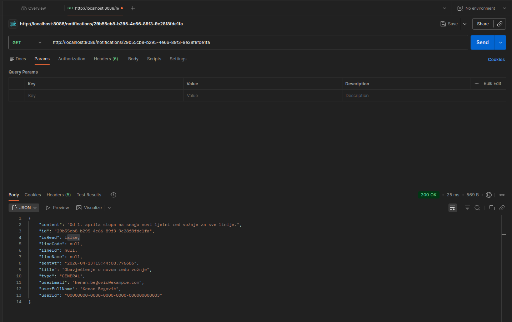
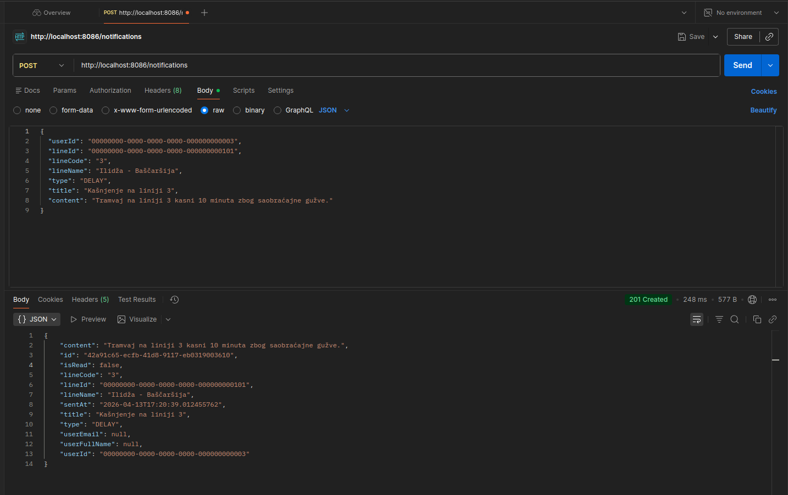
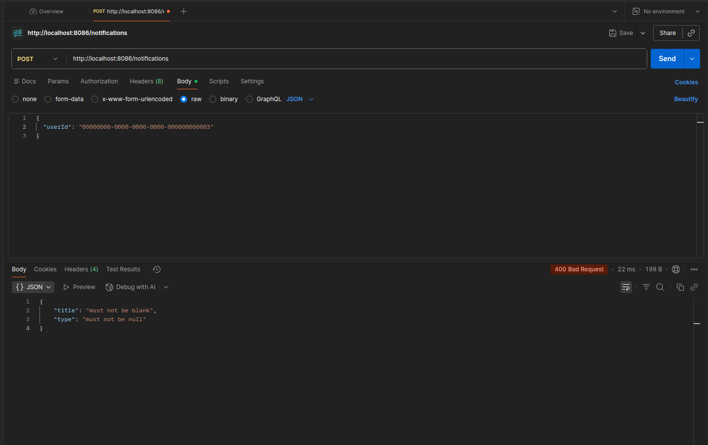
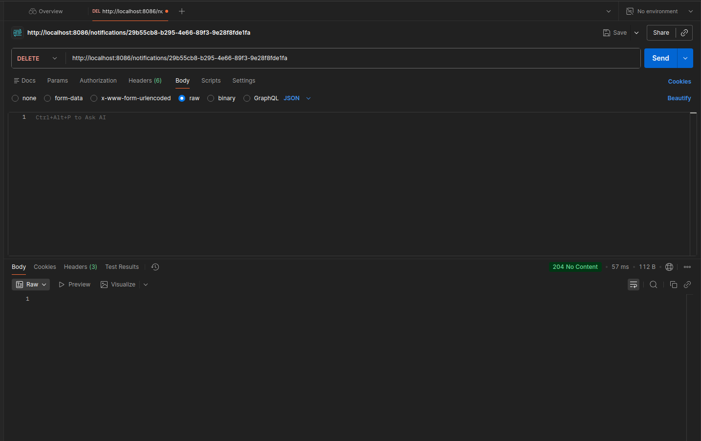

# Notification Service — API Dokumentacija

**Base URL:** `http://localhost:8086`  
**Port:** `8086`  
**Baza:** MySQL (Docker port `3312`)

Servis upravlja notifikacijama korisnika javnog prevoza u Sarajevu. Svaka notifikacija sadrži snapshot korisničkih podataka i podataka o liniji u trenutku kreiranja, bez FK veza prema vanjskim servisima.

---

## Endpointi

### GET `/notifications`
Vraća listu svih notifikacija u sistemu.


---

### GET `/notifications/{id}`
Vraća jednu notifikaciju po UUID-u.

| Parametar | Tip | Opis |
|-----------|-----|------|
| `id` | UUID | ID notifikacije |



---

### GET `/notifications/user/{userId}`
Vraća sve notifikacije za određenog korisnika.

| Parametar | Tip | Opis |
|-----------|-----|------|
| `userId` | UUID | ID korisnika |

---

### GET `/notifications/user/{userId}/unread`
Vraća nepročitane notifikacije za određenog korisnika.

| Parametar | Tip | Opis |
|-----------|-----|------|
| `userId` | UUID | ID korisnika |

---

### POST `/notifications`
Kreira novu notifikaciju.

**Request body:**
```json
{
  "userId": "00000000-0000-0000-0000-000000000003",
  "lineId": "00000000-0000-0000-0000-000000000101",
  "lineCode": "3",
  "lineName": "Ilidža - Baščaršija",
  "type": "DELAY",
  "title": "Kašnjenje na liniji 3",
  "content": "Tramvaj na liniji 3 kasni 10 minuta zbog saobraćajne gužve."
}
```

#### Uspješan zahtjev — `201 Created`



---

#### Neuspješan zahtjev — `400 Bad Request`

Poslan request bez obaveznih polja (`type`, `title`, `content`):

```json
{
  "userId": "00000000-0000-0000-0000-000000000003"
}
```



**Opis:** `@Valid` anotacija na controlleru aktivira Bean Validation. Sva obavezna polja koja nisu prisutna u requestu uzrokuju `400 Bad Request`.

---

### PATCH `/notifications/{id}/read`
Označava notifikaciju kao pročitanu.

| Parametar | Tip | Opis |
|-----------|-----|------|
| `id` | UUID | ID notifikacije |

---

### DELETE `/notifications/{id}`
Briše notifikaciju po UUID-u.

| Parametar | Tip | Opis |
|-----------|-----|------|
| `id` | UUID | ID notifikacije |


