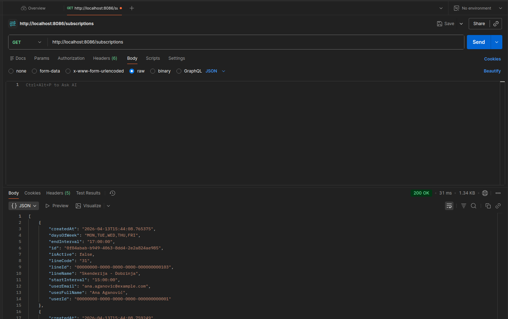
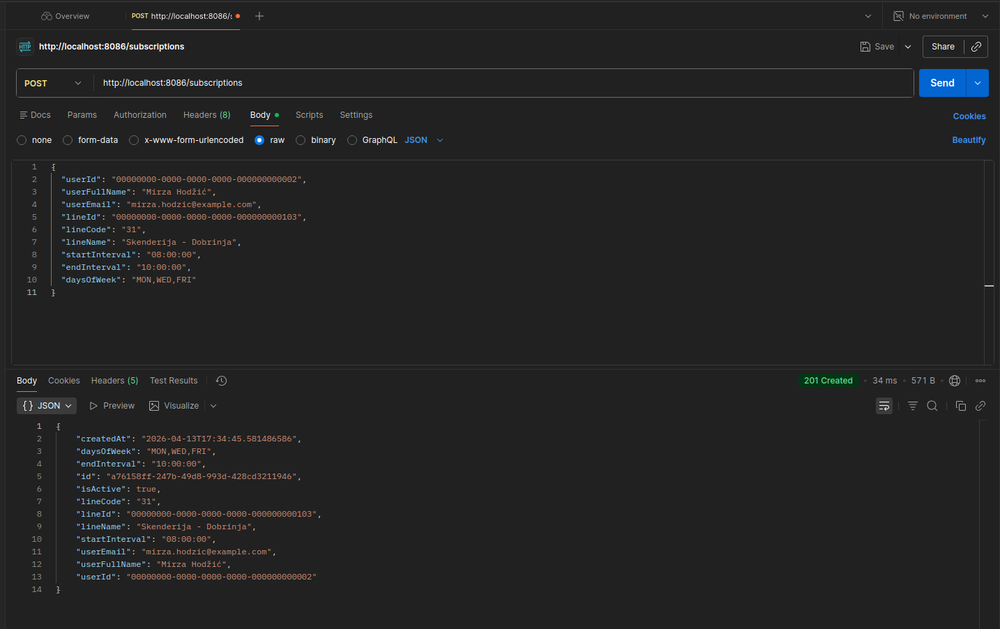
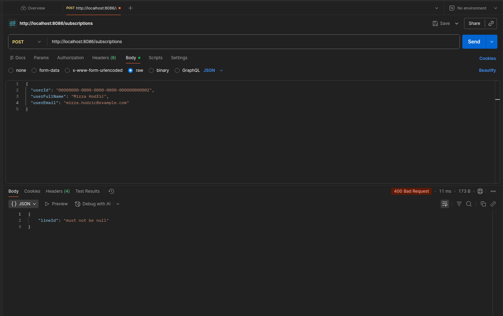

# Subscription Service — API Dokumentacija

**Base URL:** `http://localhost:8086`

Servis upravlja pretplatama korisnika na linije javnog prevoza. Korisnik se pretplaćuje na određenu liniju i definiše vremenski interval i dane kada želi primati notifikacije.

---

## Endpointi

### GET `/subscriptions`
Vraća listu svih pretplata u sistemu.



---

### GET `/subscriptions/{id}`
Vraća pretplatu po UUID-u.

| Parametar | Tip | Opis |
|-----------|-----|------|
| `id` | UUID | ID pretplate |

---

### GET `/subscriptions/user/{userId}`
Vraća sve pretplate određenog korisnika.

| Parametar | Tip | Opis |
|-----------|-----|------|
| `userId` | UUID | ID korisnika |

---

### GET `/subscriptions/user/{userId}/active`
Vraća samo aktivne pretplate određenog korisnika.

| Parametar | Tip | Opis |
|-----------|-----|------|
| `userId` | UUID | ID korisnika |

---

### GET `/subscriptions/line/{lineId}`
Vraća sve pretplate na određenu liniju.

| Parametar | Tip | Opis |
|-----------|-----|------|
| `lineId` | UUID | ID linije |

---

### GET `/subscriptions/search`
Pretraživanje pretplata po imenu ili emailu korisnika.

| Query param | Tip | Opis |
|-------------|-----|------|
| `name` | String | Ime korisnika |
| `email` | String | Email korisnika |

**Primjer:**
```
GET /subscriptions/search?email=ana.aganovic@example.com
```

---

### POST `/subscriptions`
Kreira novu pretplatu.

**Request body:**
```json
{
  "userId": "00000000-0000-0000-0000-000000000002",
  "userFullName": "Mirza Hodžić",
  "userEmail": "mirza.hodzic@example.com",
  "lineId": "00000000-0000-0000-0000-000000000103",
  "lineCode": "31",
  "lineName": "Skenderija - Dobrinja",
  "startInterval": "08:00:00",
  "endInterval": "10:00:00",
  "daysOfWeek": "MON,WED,FRI"
}
```

#### Uspješan zahtjev — `201 Created`



---

#### Neuspješan zahtjev — `400 Bad Request`

Poslan request bez obaveznih polja (`lineId`, `lineName`, itd.):

```json
{
  "userId": "00000000-0000-0000-0000-000000000002",
  "userFullName": "Mirza Hodžić",
  "userEmail": "mirza.hodzic@example.com"
}
```



**Opis:** Obavezna polja koja nedostaju uzrokuju `400 Bad Request` kroz Bean Validation.

---

### PATCH `/subscriptions/{id}/deactivate`
Deaktivira pretplatu po UUID-u.

| Parametar | Tip | Opis |
|-----------|-----|------|
| `id` | UUID | ID pretplate |

---

### DELETE `/subscriptions/{id}`
Briše pretplatu po UUID-u.

| Parametar | Tip | Opis |
|-----------|-----|------|
| `id` | UUID | ID pretplate |
