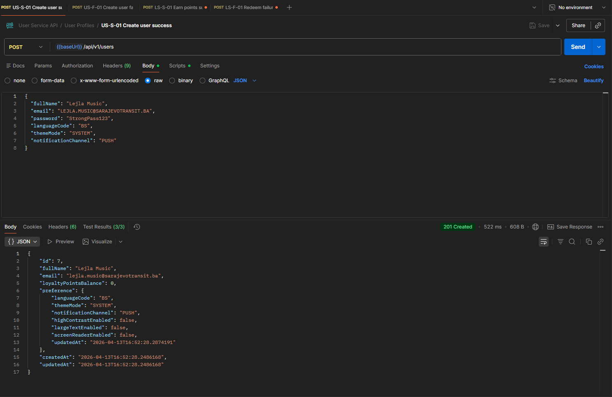
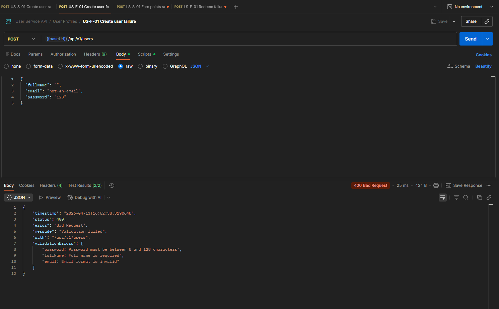
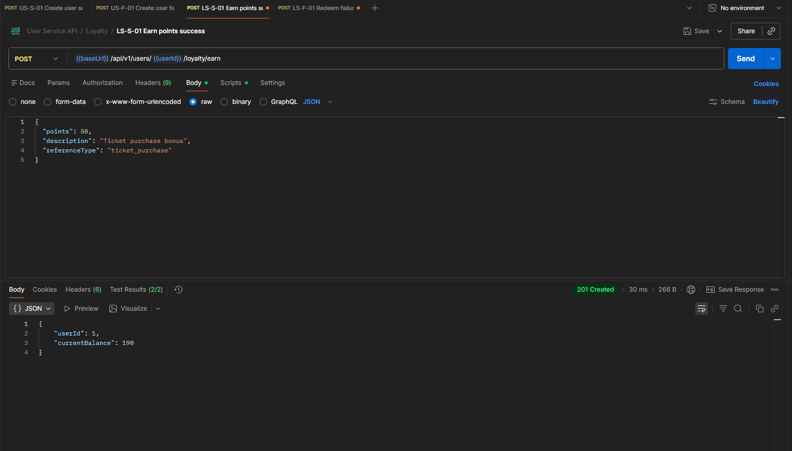
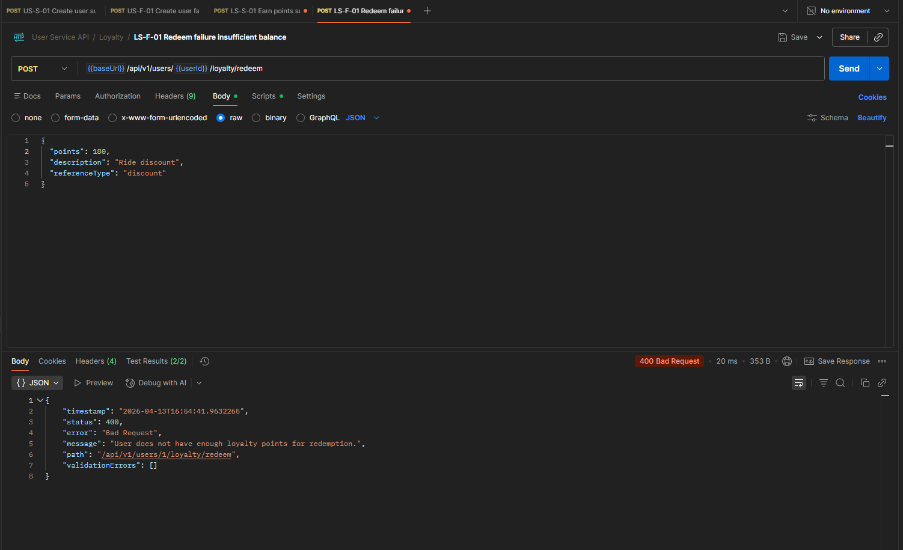

# Screenshots from tests

Successful create user request-response (HTTP 201).

Failed create user request-response with invalid payload (HTTP 400).

Successful loyalty earn request-response (HTTP 200).

Failed loyalty redeem request-response with insufficient balance (HTTP 400).

Recommended source requests are already in the collection:

- docs/postman/userservice.postman_collection.json
